# 블로그
* 멋쟁이 사자처럼 클래스 라이언 과제 2, blog
* 본 프로젝트는 기본 프로젝트에서 소소한 발전이 있었습니다.
* 블로그의 이름은 "빨리감기"입니다.

## 다양한 기능
* 회원가입, 로그인, 로그아웃할 수 있습니다.
* 글을 삭제할 수 있습니다.
* 글을 수정할 수 있습니다.
* 글을 보는 중에 다음 글, 이전 글로 바로 바로 이동할 수 있습니다.
* 기본 path를 blog로 redirect하였습니다.
* POST 요청으로 처리하여 조금 더 안전합니다.
* ~~사진을 업로드할 수 있으려 했는데 아쉽게도 업로드는 안 됩니다 :(~~
* 사진 업로드가 가능합니다!
* linebreak를 구현하였습니다.
* 모델 부분에서 소소한 수정이 있었습니다.
* 페이지네이션
* 좋아요와 조회수 기능을 구현할 예정입니다..
* 게시글 검색 기능을 구현할 예정입니다..

## 디자인
* 디자인이 개선되었습니다.
* 직접 빌드하여 보면 소소한 애니메이션이 많습니다.
* Grid를 이용하여 한 번에 많은 게시글, 사진을 볼 수 있도록 구현하였습니다.
* Typography, Simple 디자인입니다.
* Semantic UI와 약간의 js를 이용하여 구현하였습니다.

### PC 스크린샷

#### 블로그

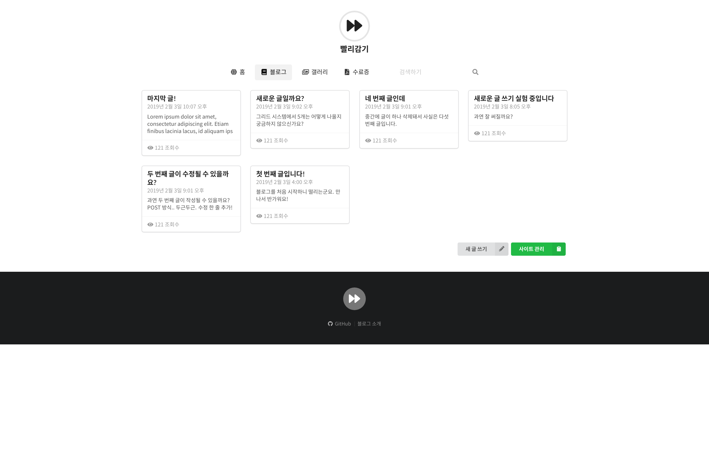

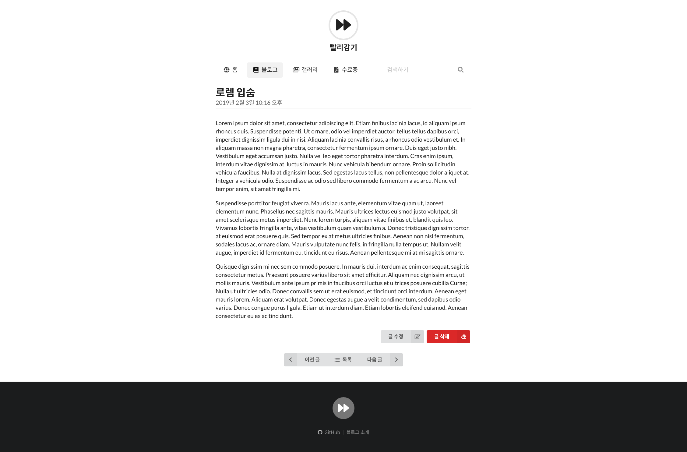

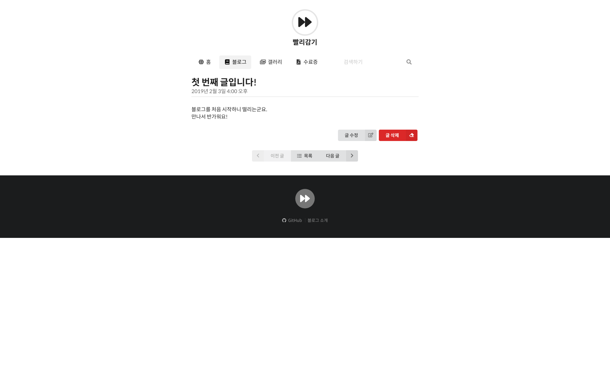

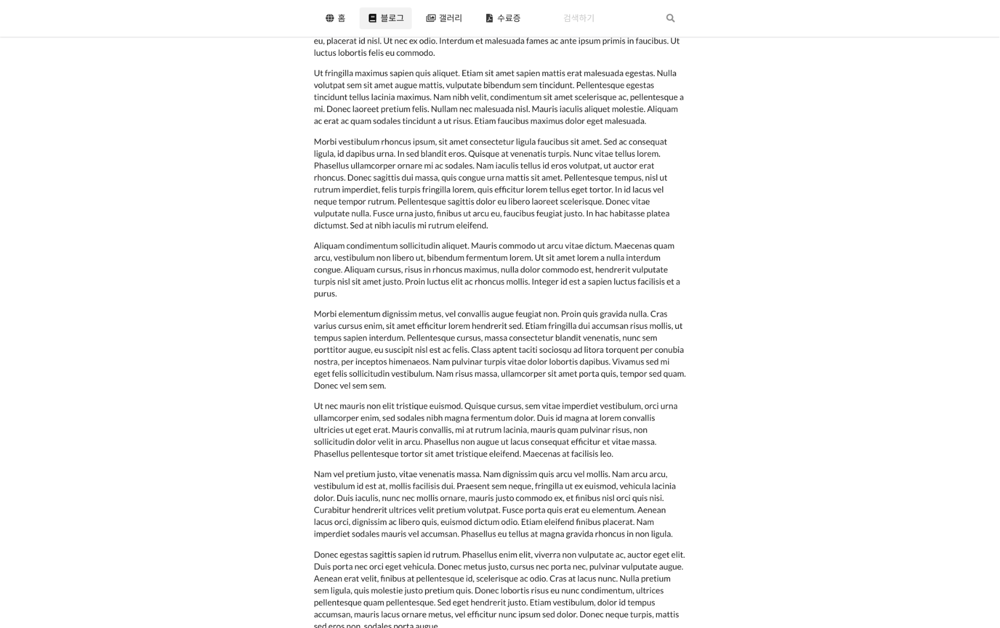

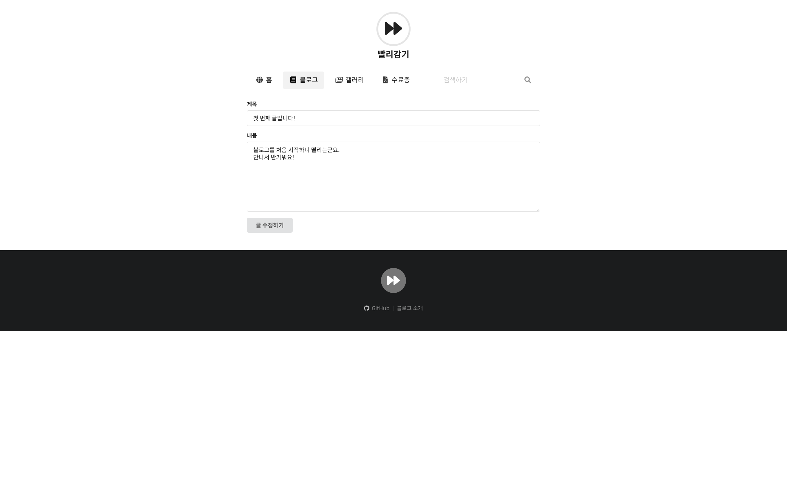

#### 갤러리

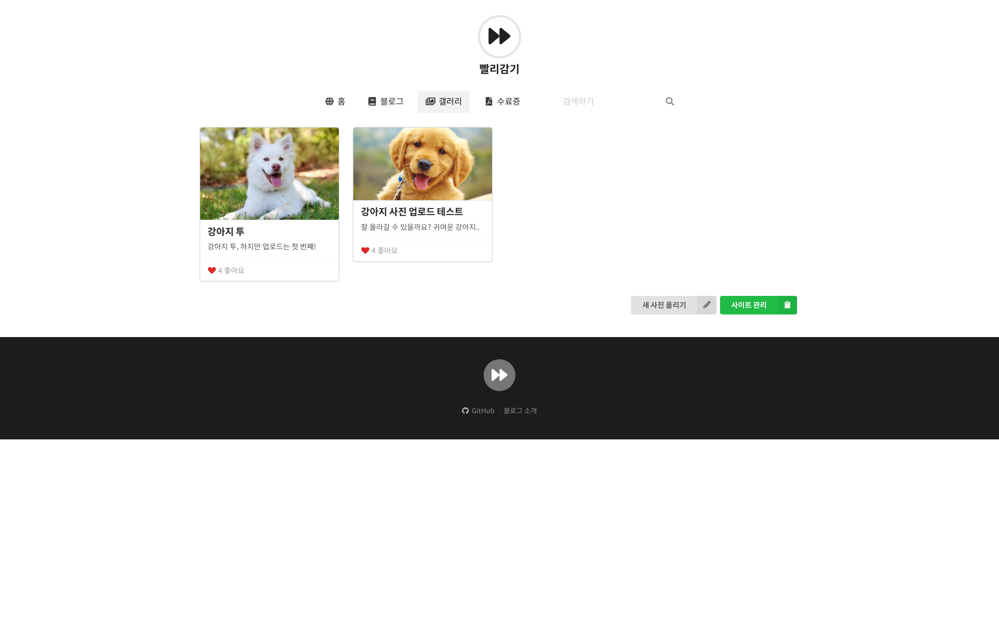

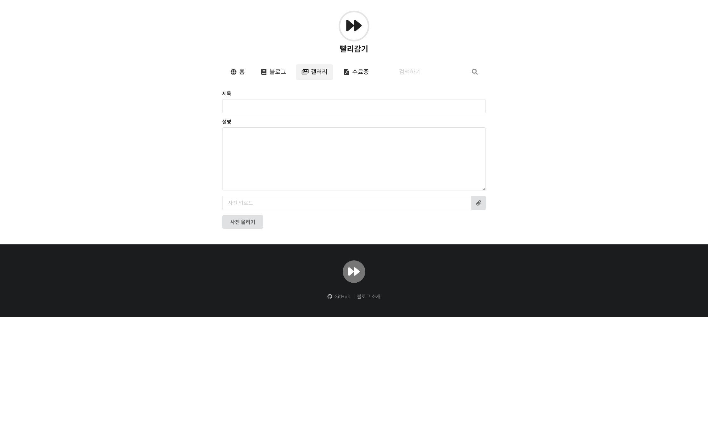

### 모바일 스크린샷

* 반응형 디자인으로, 모바일에서도 완벽하게 디자인되어 있습니다.
* 테스트 기기는 iPhone X입니다.

#### 블로그

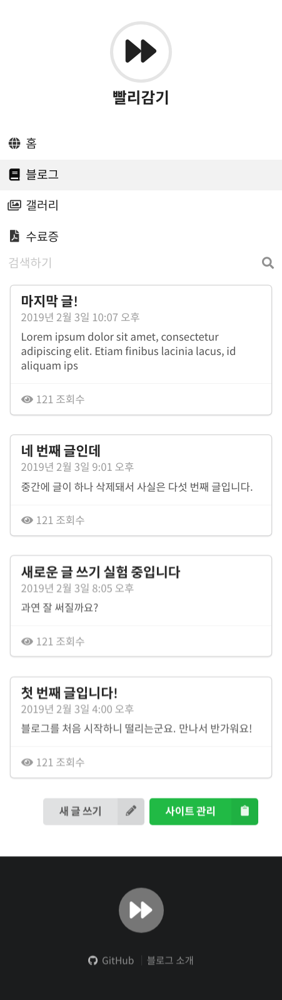

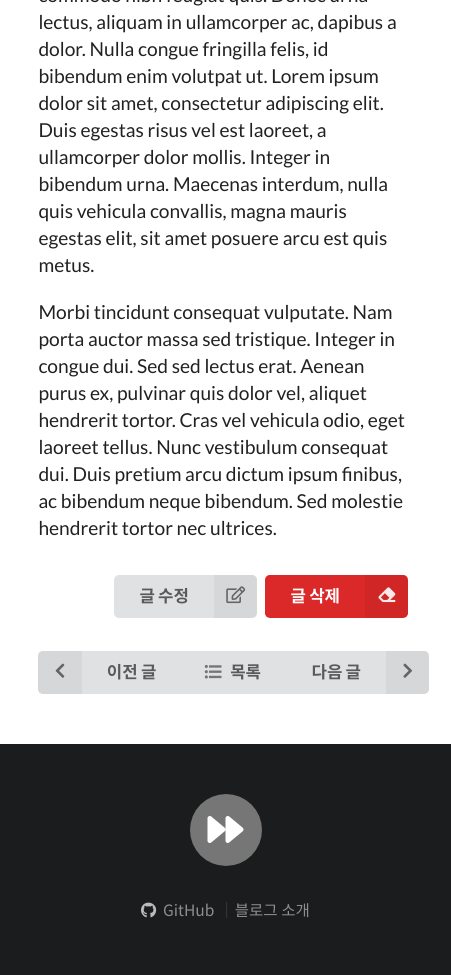

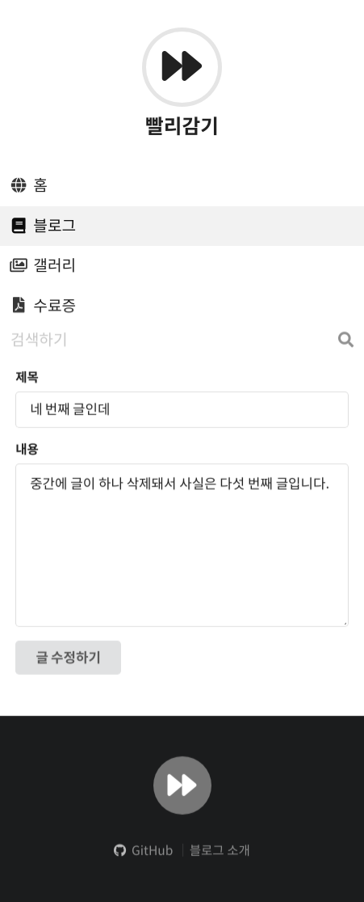

#### 갤러리

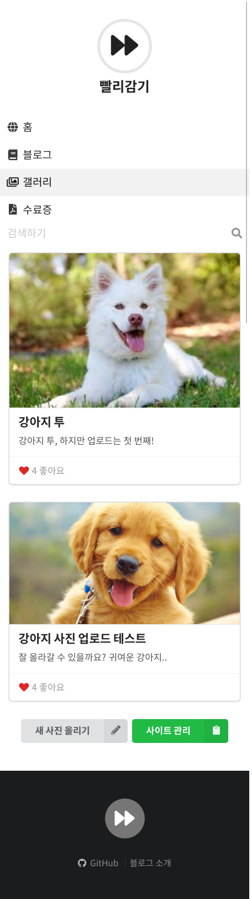

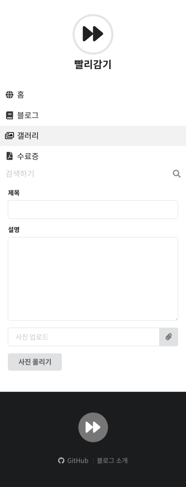

## 기타
* 뭔가 많이 한 것 같은데 별로 없는 것 같기도 합니다.
* 부트스크랩과는 색다른 프론트엔드 프레임워크, Semantic UI!

## 개발 환경
* Linux Mint 19.1 Cinnamon
* Google Chrome 72.0.3626.81
* Pycharm Professional 2018.3.3
* Python 3.7.2
* Django 2.1.5
* 기타 requirements.txt 참고
